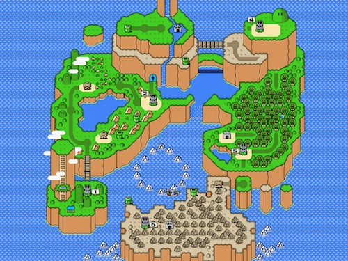

# File I/O Continued

## Description

Create a project called `Countries` with [this file](https://raw.githubusercontent.com/oakes/java-assignments/master/projects/Countries/countries.txt) in the project root. Parse each line and store the contents into a data structure. Ask the user to type a letter and save a file that lists only the countries starting with it.

## Requirements

* Create a `Country` class to store both the name and abbreviation.
* Read and parse the "countries.txt" file into an `HashMap<String, ArrayList<Country>>` where the key is a single letter and the value is a list of countries whose names start with that letter.
* Ask the user to type a letter (if they don't type a single letter, throw an exception).
* Save an "X_countries.txt" file, where X is the letter they typed, which only lists the countries starting with that letter.
* Optional tasks
  * Break your code into separate methods, especially the `for` loop that loops over each line in the file, and the code under it that reads the user's input and writes the file.
  * Write tests for your methods where it makes sense to.
  * Encode the output as JSON instead of building a string manually. You should be able to take the `ArrayList` you pulled out of your `HashMap` and directly pass it to the `serialize` method. Remember to add getters to your `Country` class.
  * Override the `toString` method in your `Country` class so when you print your `HashMap` you can see the country abbreviations and names. Recall that, by default, Java prints out objects liket his: `Country@21345362`.
